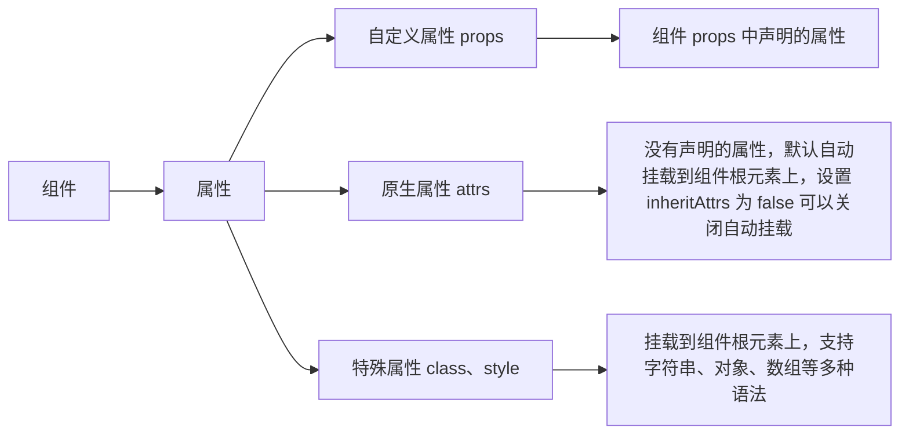

# Vue

[toc]

## 引入 Vue

```html
<div id="box">{{10+20}} {{myName}}</div>
<div>{{10+20}}</div>
<script>
  var vm = new Vue({
    el: '#box',
    // 页面直接引入vue的data写法
    data: {
      myName: 'freysu1' //状态 vm.myName = "ddd" 就可以直接修改 myName
    }
    // vue-cli版本
    // data() {
    //  return {
    //   myName: "freysu"
    //  }
    // }
  })
</script>
```

## 初始 Vue 的响应式原理

当你把一个普通的 JavaScript 对象传入 Vue 实例作为 data 选项，Vue 将遍历此对象所有的 property，并使用 Object.defineProperty 把这些 property 全部转为 getter/setter。
Object.defineProperty 是 ES5 中一个无法 shim 的特性，这也就是 Vue 不支持 IE8 以及更低版本浏览器的原因。

> 面试回答：
> 每次数据更改的时候通过 setter 拦截，通知 watcher 触发更新，watcher 是观察者，它收集了很多状态相关的依赖以及发布者订阅者，触发这些订阅者进行调用吗，这样组件就会得到更新。虚拟 DOM，diff 算法往后会学到。

### Vue3 的变化

Object.defineProperty 有以下缺点。

1. 无法监听 ES6 的 Set、Map 变化；
2. 无法监听 Class 类型的数据
3. 属性的新加或者删除也无法监听
4. 数组元素的增加和删除也无法监听

针对 Object.defineProperty 的缺点，ES6 Proxy 都能够完美地解决。它唯一的缺点就是对 IE 不友好，所以 Vue3 在检测到如果是使用 IE 的情况下（没错，IE11 都不支持 Proxy），会自动降级为 Object.defineProperty 的数据监听系统。

```js
var obj = {}
Object.defineProperty(obj, 'myName', {
  // ES6 写法
  get() {
    console.log('get') // 当访问变量时就会触发这个函数，obj.myName
  },
  set(value) {
    console.log('set: ', value) // 当修改变量的值时将会触发这个函数，obj.myName = "xxx"
  }
  // ES5
  // get: function () {},
  // set: function () {}
})
```

## 组件

Vue 组件 = Vue 实例 = new Vue(options);
组件的三大核心概念——属性、事件、插槽

### 为什么组件化？

扩展 HTML 元素，封装可重用的代码

### Vue.component 缺点

1. 全局定义：强制要求每个 component 中的命名不能重复
1. 字符串模板：缺乏语法高亮，在 HTML 有多行的时候，需要用到丑陋的`\`
1. 不支持 CSS：意味着当 HTML 和 JavaScript 组件化时，CSS 明显被遗漏
1. 没有构建步骤：限制只能使用 HTML 和 ES5 JavaScript，而不能使用预处理器，如 Pug(formerly Jade) 和 Babel

#### 组件的组成 - 属性



##### 自定义属性 props

1. 不推荐使用数组形式，不利于后期维护，尽可能用对象形式

   ```js
   //bad
   props:['a','b','c']
   // good
   props:{'a':{ },'b':{ },'c':{ }}
   ```

> 以上内容编写于 2022 年 6 月 10 日 04 点 04 分

#### diff 算法

1. 同层级对比
2. 同标签，组件 对比
3. 同 key 对比

#### transition 过渡

Vue 在插入、更新或者移除 DOM 时，提供多种不同方式的应用过渡效果。

1. 单元素/组件过渡

   - css 过渡
   - css 动画
   - 结合 animate.css 动画库

   ```html
   <transition
     name="custom-classes-transition"
     enter-active-class="animated tada"
     leave-active-class="animated bounceOutRight"
   >
     <p v-if="show">hello</p>
   </transition>
   ```

2. 多个元素过渡（设置 key）

### 自定义指令

1. 自定义指令 directives - 对普通 DOM 元素进行底层操作

### 单文件组件

node,npm,webpack,babel,sass,postcss,...,vue-cli

## SPA

SPA：单页面应用（SinglePage Web Application）

MPA：多页面应用（MultiPage Application）

|                      | 单页面应用（SinglePage Web Application,SPA）                           | 多页面应用（MultiPage Application,MPA）       |
| -------------------- | ---------------------------------------------------------------------- | --------------------------------------------- |
| 组成                 | 一个外壳页面和多个页面片段组成                                         | 多个完整页面构成                              |
| 资源共用(css,js,...) | 共用，只需在外壳部分加载                                               | 不共用，每个页面都需要加载                    |
| 刷新方式             | 页面局部刷新或更改                                                     | 整页刷新                                      |
| url 模式             | `a.com/#/pageone`</br>`a.com/#/pagetwo`                                | `a.com/pageone.html`</br>`a.com/pagetwo.html` |
| 用户体验             | 页面片段间的切换快，用户体验良好                                       | 页面切换加载缓慢，流畅度不够，用户体验比较差  |
| 转场动画             | 容易实现                                                               | 无法实现                                      |
| 数据传递             | 容易                                                                   | 依赖 url 传参或者 cookie、localStorage 等     |
| 搜索引擎优化(SEO)    | 需要单独方案，实现较为困难，不利于 SEO 检索，可利用服务端渲染(SSR)优化 | 实现方法简易                                  |
| 适用范围             | 高要求的体验度、追求界面流畅的应用                                     | 适用于追求高度支持搜索引擎的应用              |
| 开发成本             | 较高，常需借助专业的框架                                               | 较低，但页面重复代码多                        |
| 维护成本             | 相对容易                                                               | 相对复杂                                      |

## Vue-router

- 动态路由匹配
- 嵌套路由
- 编程式导航（js跳转）vs 声明式导航`<router-link>`

  ```vue-html
  <router-link v-shot="{navigate,isActive}" to="films" custom>
    <li :class="isActive?'frey-active':''" @click="navigate">films</li>
  </router-link>
  ```

- 命名路由（`$route.name`获取命名路由的名字）
- 重定向和别名

  ```js
  const router = new VueRouter({
    routes:[
      {path:"/a",redirect:"/b"}
    ]
  })
  ```
